> Necro 是一个用 Python 编写、快速迭代的僵尸网络家族。本文按时间线拆解它的四个版本：IRC C2 通信、DGA 与 Tor 隐藏 C2、漏洞利用传播，以及第四版新增的 Windows 感染与持久化。

**Necro家族分析报告总结：**

## 背景

Necro僵尸网络2021年1月份首次被360netlab披露,自披露以后消匿了一段时间,最近又开始活跃.该家族是用python编写完成的。作者是N3Cr0m0rPh(Necromorph)，版本更新快，目前分为四个版本更替。截至到2021.3.18日，样本中内置了最新的漏洞进行攻击传播。我们根据样本出现的时间把样本分为四个版本。目前分析的4个版本都是基于V8魔改后的版本,V8之前的代码如下图所示：

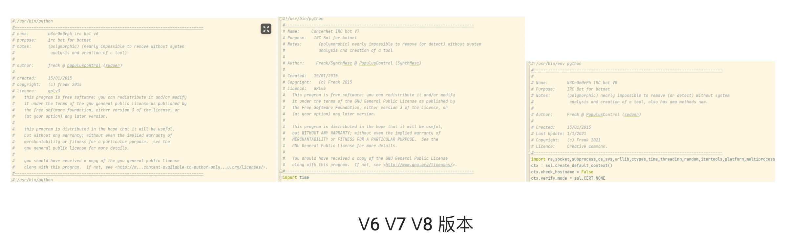

第一个版本是单纯的Bot，利用IRC 协议进行C2 通信，内置了ddos攻击指令，downloaed，Reapacked，shell，arp嗅探等命令。  
第二版本增加了弱口令爆破和CVE漏洞利用，来实现传播扩展，代码对抗方面做了简单的混淆。  
第三版在之前基础上，IRC通信增加了SSL验证，内置了8种以上的最新漏洞利用进行传播。利用DGA来生成C2域名以及进行严重的代码混淆来对抗检测。  
第四版,在域名方面引入了Tor代理和”DGA+随机域名”结合的方式进行C2 通信。除此之外，前三个版本均是针对linux,在第四版中,新增了针对windows的感染传播和持久化控制方式，js挂马功能主要目的是在Web页面嵌入挖矿代码，这意味着当终端用户使用手机、PC或是其它设备浏览失陷设备（包括服务器和NAS设备）的相关Web页面时，可能沦为矿机并泄露敏感信息。

## 样本分析

### 第一版

**样本流程图：**

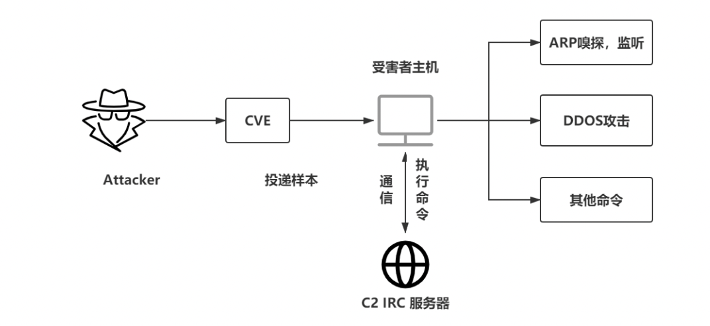

**样本的主要功能：**

1.  IRC 服务的初始化

    样本首先随机生成8-12个随机字符串作为自己的nick\_name的一部分，用于标识自己的唯一性。然后进行base64解码，service\_ip，port，channel，channel\_key。并开启一个新的线程去做ARP投毒和流量嗅探。如图1所示

    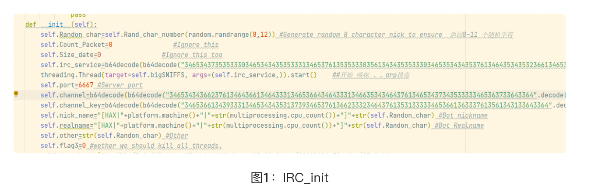

```text
样本的上线 使用IRC 协议：
irc server：45.145.185.229：6667
channel：  #necro
channel_key：m0rph
nick_name："[HAX|"+platform.machine()+"|"+str(multiprocessing.cpu_())+"]"+str(self.Randonchar)
```

2.  对函数名称进行重命名，轻度混淆。如图2所示：

    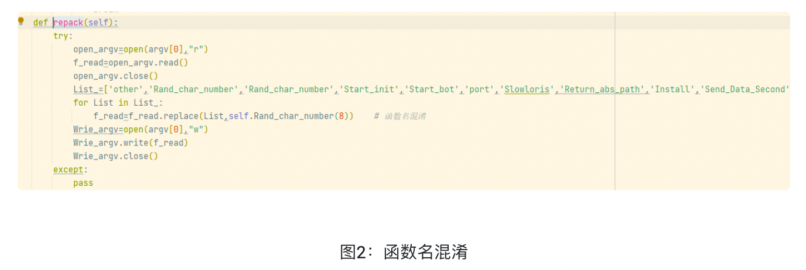

3.  持久化控制，文件写入启动项，把自己拷贝到/etc目录下。如图3所示：

    <!-- TODO 图片缺失：image-20250519202238475-7657359-7657360-7657361-7657362.png（原图只在旧电脑的 Typora 缓存里） -->

4.  加入IRC服务器，接收等待接受指令，进行操作

    1.  加入IRC 服务器，如图4所示：

        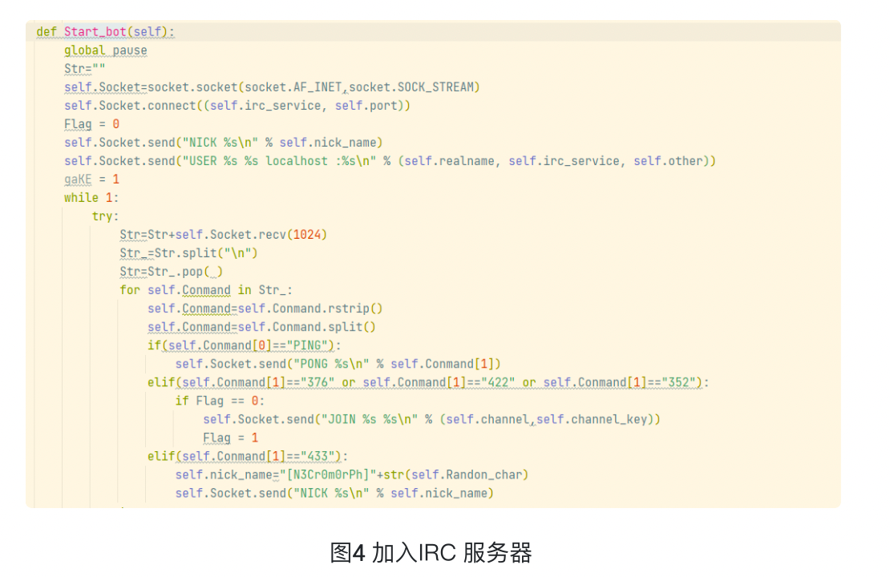

    2.  对来自IRC服务器的命令进行解析，并执行。ddos攻击命令如图5所示，bot命令如图6所示。支持的命令多达16种（其中包括DDOS攻击指令和其他命令执行），包括：

        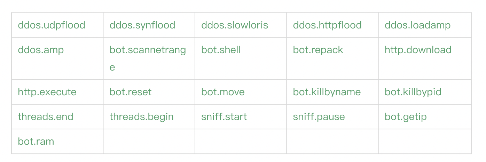

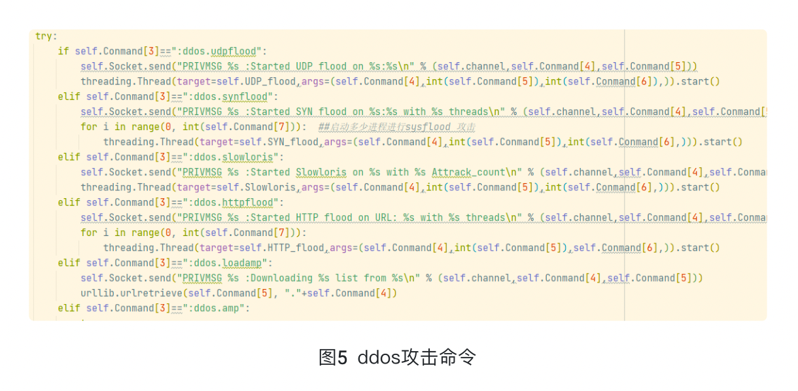

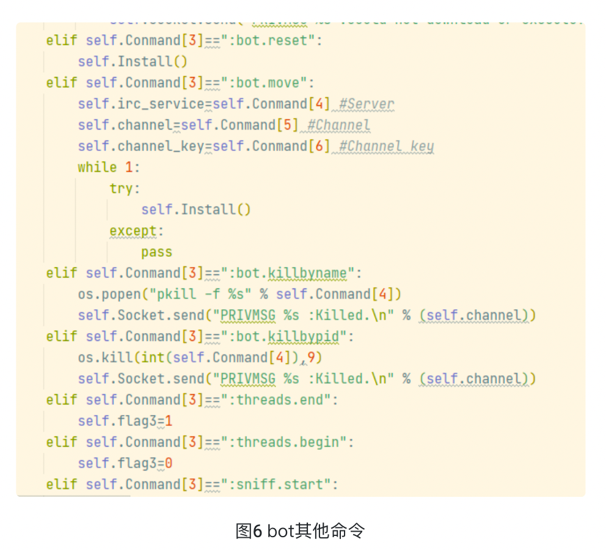

5.  样本中有ARP嗅探和 流量监听，监听 22、23、53、443、1337、6667、37215 端口之外的其他端口流量，并上报给 C2 服务器，代码如图7所示：

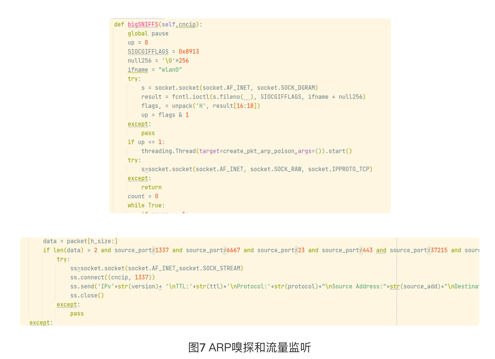

6.  样本进行自我删除。如图8所示：

    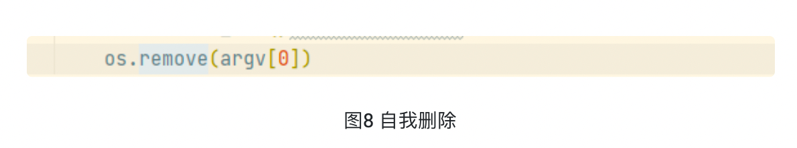

### 第二版

**样本流程图：**

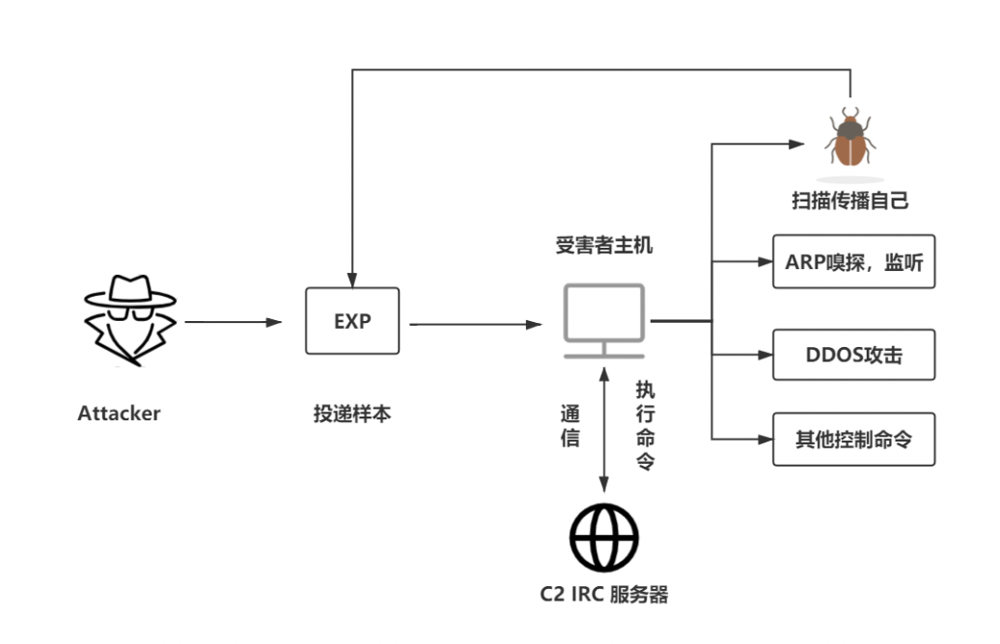

**样本新增功能：**

1.  IRC 服务器进行了更新：

    ```text
    IRC Server: gxbrowser.net:6667
    Chanel:	#update
    Chanel_key:	N3Wm3W
    Nick_Name:	"[HAX|"+platform.machine()+"|"+str(multiprocessing.cpu_count())+"]"+str(self.Randon_char)
    ```

2.  新增自我传播功能。样本启动多个线程利用3个远程RCE漏洞进投递传播

    洞是2021年1月4日曝光）。部分代码如图9所示：

    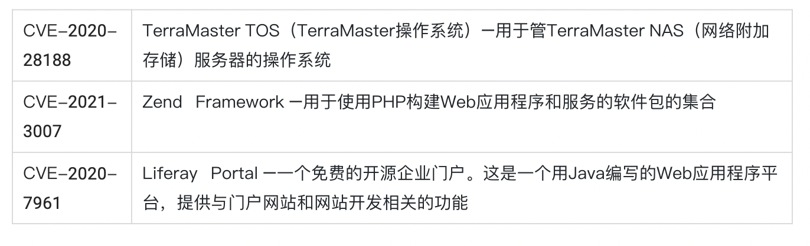 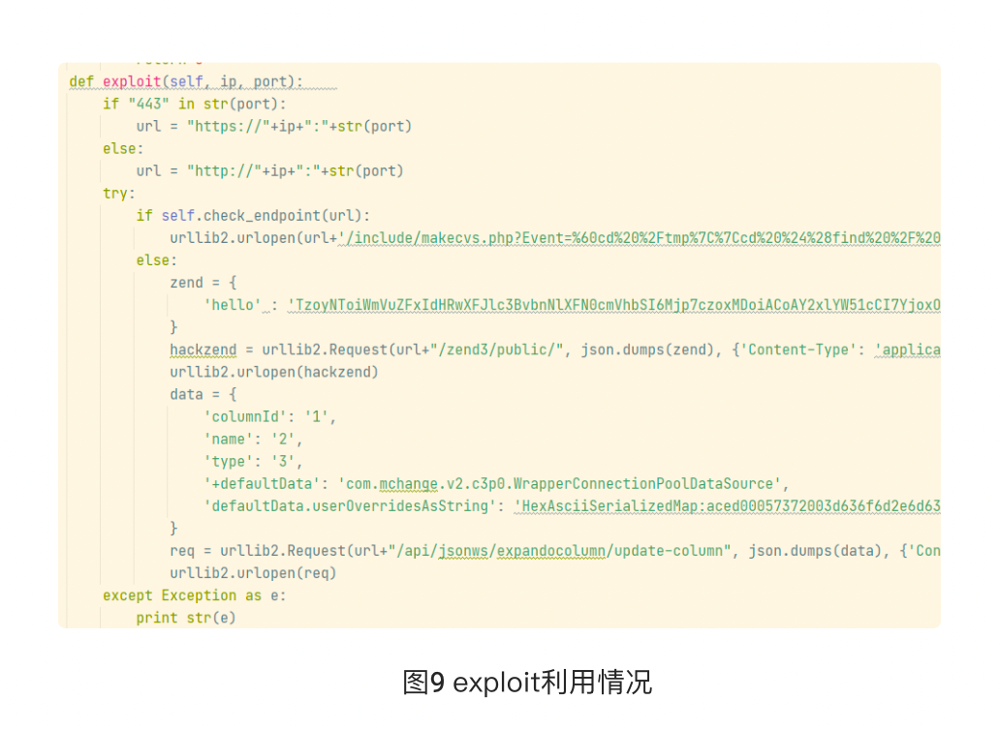

### 第三版

**样本流程图：**

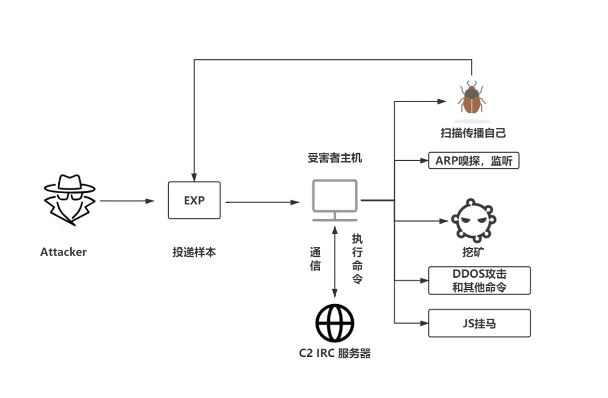

**样本新增功能模块：**

1.  在C2服务器方面，第三版使用了动态DGA算法生成域名，种子是 0x4FE6DA。同时对加入IRC服务进行SSL校验。这大大加强了对C2服务器的保护。

    ```python
    def gen_random_str(bmKdhIqSwVo):
    	return ''.join(random.choice("abcdefghijklmnopqoasadihcouvwxyzABCDEFGHIJKLMNOPQRSTUVWXYZ") for _ in range(bmKdhIqSwVo))
    def DGA_gen_cc(count):
    	random.seed(a=0x4FE6DA+count)
    	return gen_random_str(16)+".xyz"
    for count in range(0, 4096):
    	Service_name=DGA_gen_cc(count)
    	print(Service_name)
    ```

2.  代码混淆方面。第三版的样本被进行重度混淆，对于函数名使用ast随机重命名，字符串参数进行zlib.compress压缩过。

3.  漏洞利用方面。进行了多种漏洞利用，新增了**5**种漏洞进行自我传播。

    -   CVE-2018-7600, Drupal
    -   EyesOfNetwork 5.1 - Authenticated Remote Command Execution
    -   CVE-2020-35131
    -   Gila CMS 2.0.0 - Remote Code Execution (Unauthenticated)
    -   CVE-2020-35729

4.  控制命令方面。新增了reflect，addport，delport，injectcount，reinject等命令。其中的reinject命令，会进行JS挂马，在Web页面嵌入挖矿代码，这意味着当终端用户使用手机、PC或是其它设备浏览失陷设备（包括服务器和NAS设备）的相关Web页面时，可能沦为矿机并泄露敏感信息。如图10所示：

    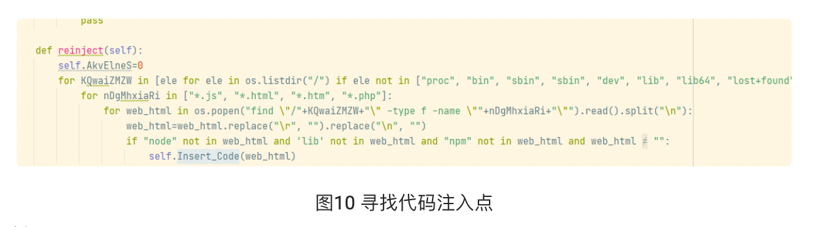

### 第四版

**样本新增功能：**

1.  C2服务器方面。对于域名的对抗继续加强，使用了NO-IP.COM动态域的DGA域名。使用Tor硬编码代理进行通信。如图11所示：

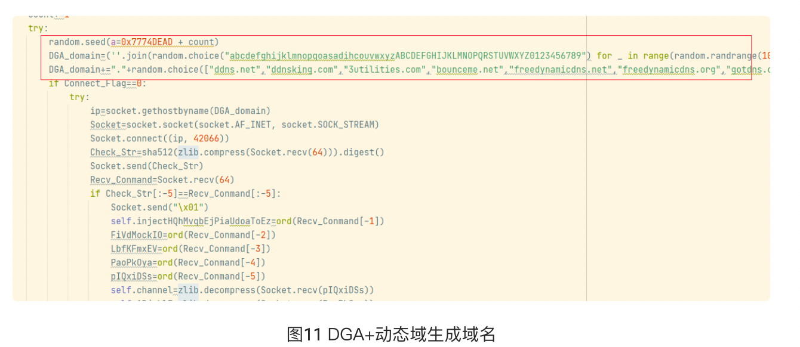

2.  针对Windows和linux两种系统。第四版中，新加入了针对windows端的一些列操作，包括将文件写入注册表以保证开机自启、Windows Rootkit注入（使用了github上的dll编写shellcode，实现注入，针对32位和64位均可实现），实现持久化控制。具体代码如图12所示：

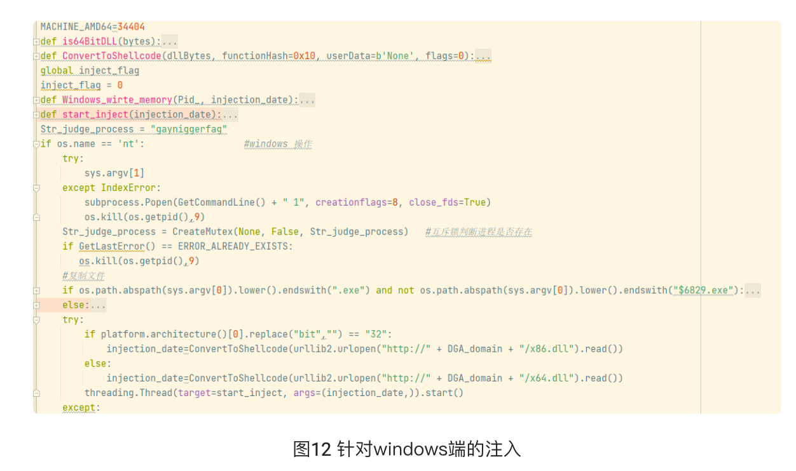

3.  在漏洞利用方面。第四版持续新增漏洞利用方式，新增了传播方式。

    -   Laravel RCE(CVE-2021-3129)
    -   WebLogic RCE (CVE-2020-14882)
    -   TerraMaster RCE（CVE2020\_35665）
4.  控制命令方面。新增了Tor DDOS 攻击，如图13所示

    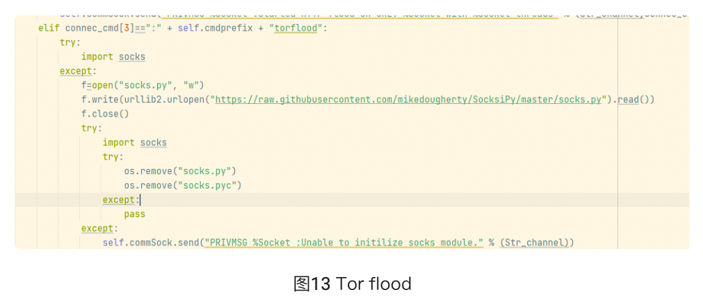

## 相关溯源信息

**针对 C2 上线的数目：**

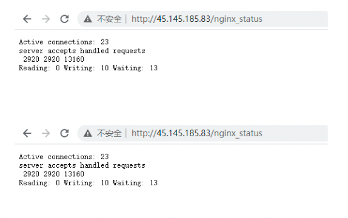

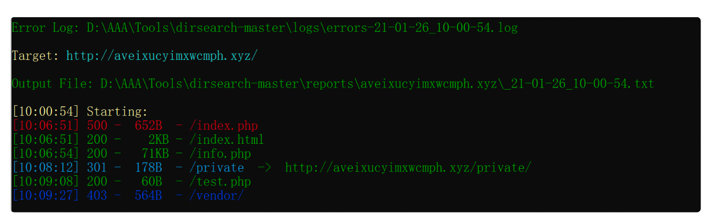

攻击流量包：

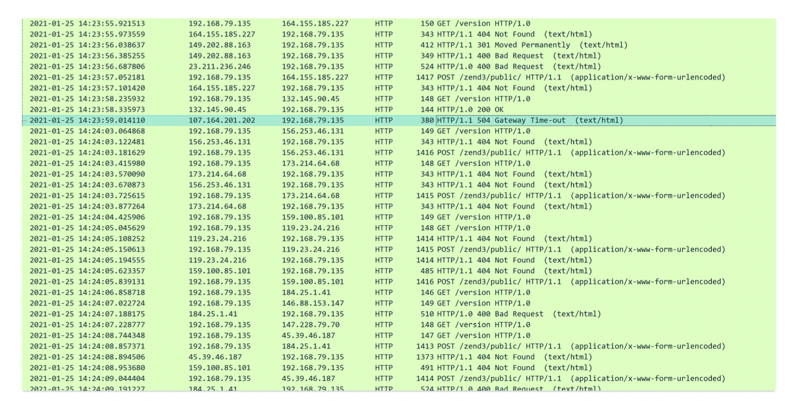

8种漏洞利用：

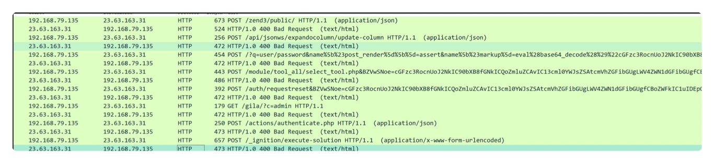

IRC 聊天室相关信息：

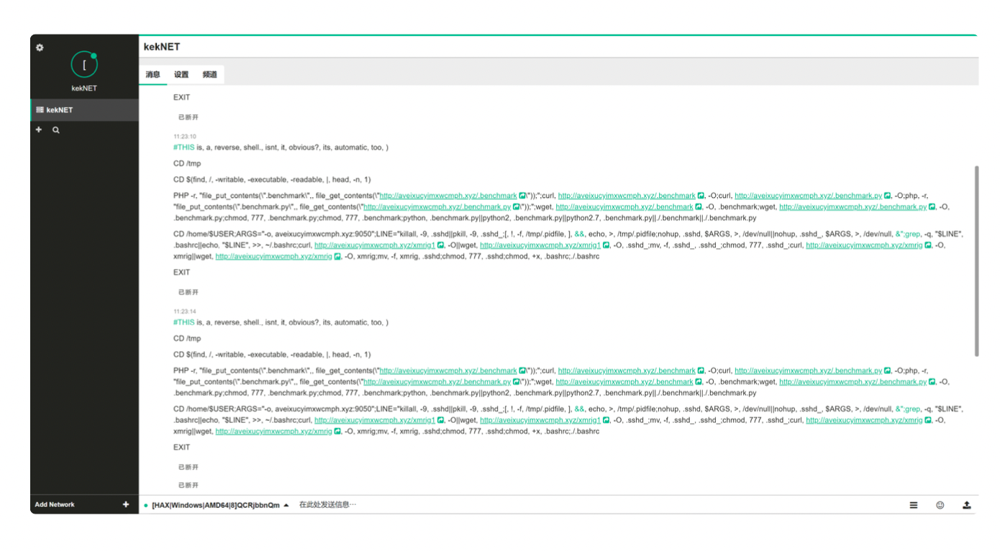

## 参考资料

1.  [绿盟科技](https://mp.weixin.qq.com/s/D30y0qeicKnHmP9Kad-pmg)

2.  [360netlab](https://blog.netlab.360.com/tor-bld/)
